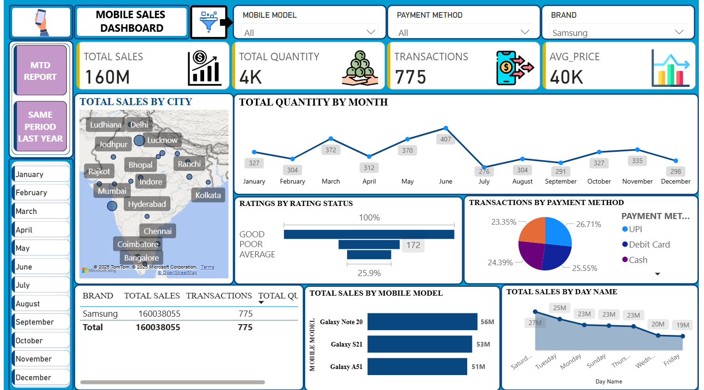
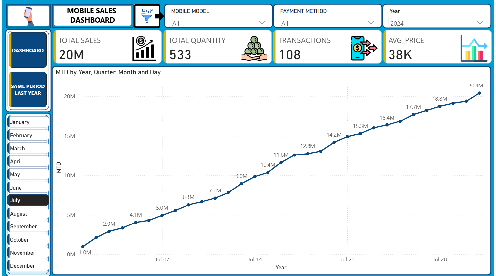
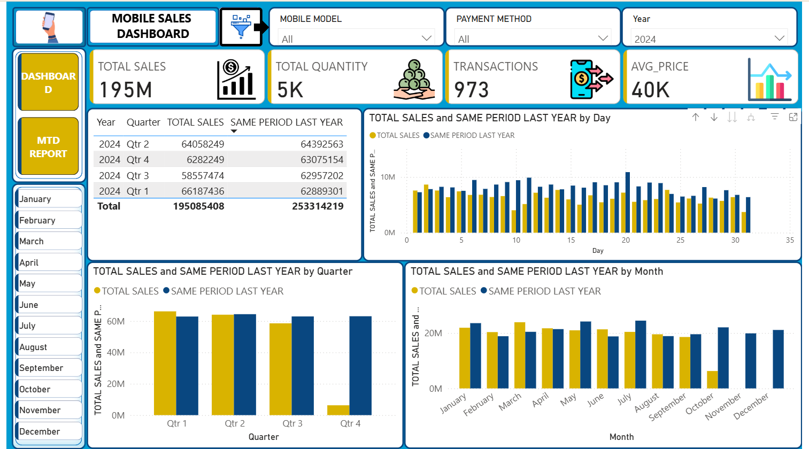

# 📱 Mobile Sales Analytics Dashboard – Power BI  
**Project by: Lavanya Pashine**

An interactive and visually rich **Power BI dashboard** analyzing mobile phone sales across India.  
This report provides insights on **sales trends, customer behavior, payment preferences, brand performance, and model-level analysis**.

---

## 📌 **🔗 Power BI Dashboard – Live Link** 
**https://app.powerbi.com/view?r=eyJrIjoiYmRjMTM3NWMtYzJkMS00ZWMwLTk0YWItMTQ0NWFhZTQ1MDdmIiwidCI6ImNiZDg4NjMyLTc2YTgtNGE3Mi1hYjlmLTJmODVhZTZmYjllZCJ9**

---

# 🎯 **Project Overview**

This dashboard answers key business questions such as:

- How much sales revenue was generated?
- Which cities and models perform best?
- What are customer's preferred payment methods?
- How do the current numbers compare with last year?
- What is the Month-to-Date (MTD) growth?

The report contains **3 interactive pages**:

1. **Dashboard**
2. **MTD Report**
3. **Same Period Last Year (SP-LY)**

Each page contains screenshots and Q&A.

---

---

# 📘 **PAGE 1 — DASHBOARD**

## 🖼️ **Screenshot – Dashboard Page**
 

---

## ✔️ **Questions & Answers**

### **Q1. What is the total sales amount?**  
**A:** **160M**

### **Q2. How many quantities were sold?**  
**A:** **4K**

### **Q3. How many transactions took place?**  
**A:** **775**

### **Q4. What is the average selling price?**  
**A:** **40K**

### **Q5. Which cities show high sales concentration?**  
Indore, Mumbai, Hyderabad, Chennai, Bangalore, Kolkata, Lucknow.

### **Q6. What is the monthly quantity trend?**  
Peak: **June (407)**, **March (372)**  
Low: **July (276)**

### **Q7. Rating breakdown?**  
- Good – Highest  
- Average – 172  
- Poor – Lowest  

### **Q8. Which payment method is most used?**  
UPI → **26.71%**, Debit Card → **25.55%**, Cash → **24.39%**

### **Q9. Top-performing mobile models?**  
- Galaxy Note 20 – **56M**  
- Galaxy S21 – **53M**  
- Galaxy A51 – **51M**

### **Q10. Highest sales day of week?**  
- **Saturday – 27M**  
- Lowest: **Friday – 19M**

---

---

# 📘 **PAGE 2 — MTD REPORT**

## 🖼️ **Screenshot – MTD Page**

---

## ✔️ **Questions & Answers**

### **Q1. Total MTD Sales?**  
**20M**

### **Q2. Total MTD Quantity?**  
**533**

### **Q3. Total MTD Transactions?**  
**108**

### **Q4. MTD Average Price?**  
**38K**

### **Q5. Daily MTD trend?**  
Steady rise from **1M → 20.4M** by July end.

### **Q6. Major growth jumps?**  
Around: July 10, July 14, July 21, July 28.

---

---

# 📘 **PAGE 3 — SAME PERIOD LAST YEAR (SP-LY)**

## 🖼️ **Screenshot – SP-LY Page**

---

## ✔️ **Questions & Answers**

### **Q1. Quarterly comparison with last year?**

| Quarter | This Year | Last Year |
|--------|-----------|-----------|
| Q1 | 66M | 62M |
| Q2 | 64M | 64M |
| Q3 | 58M | 63M |
| Q4 | 62M | 63M |

### **Q2. Daily comparison?**  
This year maintains steady lead with slight dips.

### **Q3. Month-wise comparison?**  
This year higher in:
- January  
- February  
- March  
- November  
- December  

Slight dips in June & July.

---

---

# 📂 **Project Structure**

---

# 🛠️ **Tools & Technologies Used**

- Power BI Desktop  
- Power Query
- DAX  
- Excel  
- Data Modeling  
- GitHub Version Control  

---

# 🎓 **What I Learned from This Project**

✔ Data cleaning & transformation using **Power Query**  
✔ Designing professional **Power BI dashboards**  
✔ Creating **DAX measures** for MTD, YoY, Avg Price  
✔ Building a Proper **Date Table**  
✔ Publishing to **Power BI Service**  
✔ Organizing and documenting analytics projects for **GitHub**  
✔ Improving visual storytelling & UI/UX in dashboards  

---

# 🙌 **Developed by: Lavanya Pashine**

If you like this project, feel free to ⭐ star the repo and explore the dashboard using the link above!

